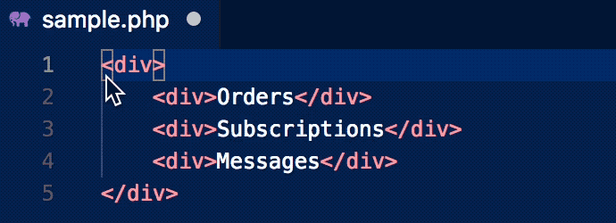

# loclz README

Localization in PHP is done using the __ function. 
Instead of rwiting literal text, the text is wrapped in __('Some text to translate'). This extension is a convenient way to wrap the text.

## Features

Wraps the selected text in `<?=__('TEXT')?>`

`
Some text to be translated
`

becomes

`
<?=__('Some text to be translated')?>
`

## Known Issues

Works with any type of file.

Only useful for text that is directly in HTML. It won't work for text that is already in a PHP wrapper.

## Release Notes

Since the text is enclosed in single quotes, any single quote characters in the selected text are escaped.

### 1.0.0

Initial release of ...

-----------------------------------------------------------------------------------------------------------

## Working with Markdown

* [Visual Studio Code's Markdown Support](http://code.visualstudio.com/docs/languages/markdown)
* [Markdown Syntax Reference](https://help.github.com/articles/markdown-basics/)

**Enjoy!**
